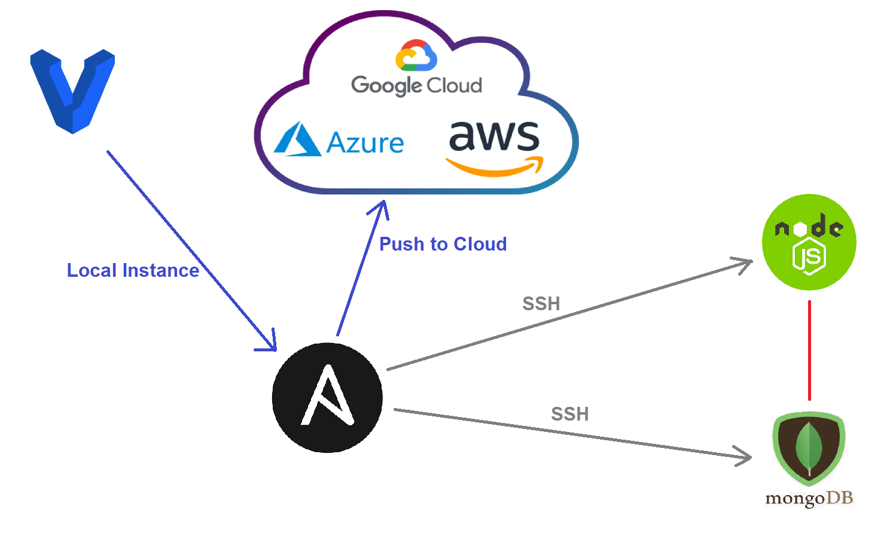

# Ansible controller and agent nodes set up guide
- Clone this repo and run `vagrant up`
- `(double check syntax/indentation)`

## We will use 18.04 ubuntu for ansible controller and agent nodes set up 
### Please ensure to refer back to your vagrant documentation

- **You may need to reinstall plugins or dependencies required depending on the OS you are using.**

```vagrant 
# -*- mode: ruby -*-
# vi: set ft=ruby :

# All Vagrant configuration is done below. The "2" in Vagrant.configure
# configures the configuration version (we support older styles for
# backwards compatibility). Please don't change it unless you know what

# MULTI SERVER/VMs environment 
#
Vagrant.configure("2") do |config|

# creating first VM called web  
  config.vm.define "web" do |web|
    
    web.vm.box = "bento/ubuntu-18.04"
   # downloading ubuntu 18.04 image

    web.vm.hostname = 'web'
    # assigning host name to the VM
    
    web.vm.network :private_network, ip: "192.168.33.10"
    #   assigning private IP
    
    config.hostsupdater.aliases = ["development.web"]
    # creating a link called development.web so we can access web page with this link instread of an IP  

    web.vm.synced_folder "app/", "/opt/vagrant/app"
    web.vm.provision "shell", path: "provision.sh", privileged: false 
        
  end
  
# creating second VM called db
  config.vm.define "db" do |db|
    
    db.vm.box = "bento/ubuntu-18.04"
    
    db.vm.hostname = 'db'
    
    db.vm.network :private_network, ip: "192.168.33.11"
    
    config.hostsupdater.aliases = ["development.db"]     
  end

 # creating are Ansible controller
  config.vm.define "controller" do |controller|
    
    controller.vm.box = "bento/ubuntu-18.04"
    
    controller.vm.hostname = 'controller'
    
    controller.vm.network :private_network, ip: "192.168.33.12"
    
    config.hostsupdater.aliases = ["development.controller"] 
    
  end

end
```


## Ansible Playbook files
For this example I have split the tasks into 3 seperate files, but in a real example it would all be in one.

### MongoDB
```
---

- hosts: db

  gather_facts: yes

  become: true

  tasks:
  - name: install mongodb
    apt: pkg=mongodb state=present

  - name: Remove mongodb file (delete file)
    file:
      path: /etc/mongodb.conf
      state: absent

  - name: Touch a file, using symbolic modes to set the permissions (equivalent to 0644)
    file:
      path: /etc/mongodb.conf
      state: touch
      mode: u=rw,g=r,o=r


  - name: Insert multiple lines and Backup
    blockinfile:
      path: /etc/mongodb.conf
      backup: yes
      block: |
        "storage:
          dbPath: /var/lib/mongodb
          journal:
            enabled: true
        systemLog:
          destination: file
          logAppend: true
          path: /var/log/mongodb/mongod.log

        net:
          port: 27017
          bindIp: 0.0.0.0"

```
### Nginx
```
---

# name of the host
- hosts: web

# finding the facts about the host
  gather_facts: yes

# we need admin access
  become: true

# instructions using tasks module in ansible
  tasks:
  - name: Install Nginx

# install nginx
    apt: name=nginx state=present update_cache=yes

# ensure it's running/active


# update cache
# restart nginx if reverse proxy is implemented or if needed
  - name: "delete current default"
    file:
      path: /etc/nginx/sites-available/default
      state: absent
  - name: "create file"
    file:
      path: /etc/nginx/sites-available/default
      state: touch
      mode: 0644
  - name: "change default file"
    blockinfile:
      path: /etc/nginx/sites-available/default
      block: |
        server {
          listen 80;
          server_name _;
          location / {
            include proxy_params;
            proxy_pass http://192.168.33.10:3000;
            proxy_http_version 1.1;
            proxy_set_header Upgrade $http_upgrade;
            proxy_set_header Connection 'upgrade';
            proxy_set_header Host $host;
            proxy_cache_bypass $http_upgrade;
          }
        }

    notify:
      - Restart nginx

  handlers:
    - name: Restart nginx
      service:
        name: nginx
        state: restarted

```
### NodeJS
"Save DB_HOST env" does not work.

```
---

- hosts: web
  gather_facts: yes
  become: true

  tasks:
    - name: Add nodejs apt key
      apt_key:
        url: https://deb.nodesource.com/gpgkey/nodesource.gpg.key
        state: present

    - name: Install nodejs
      apt:
        update_cache: yes
        name: nodejs
        state: present

    - name: Install npm
      apt: pkg=npm state=present

    - name: Install pm2
      npm:
        name: pm2
        global: yes
        production: yes
        state: present

    - name: Stop APP
      shell: pm2 kill
      args:
        chdir: /home/vagrant/app/
      ignore_errors: yes

    - name: Save DB_HOST env
      become_user: vagrant
      shell: |
        export DB_HOST=mongodb://192.168.33.11:27017/posts >> ~/.bashrc
        export DB_HOST=mongodb://192.168.33.11:27017/posts

    - name: Seed database
      shell: node seeds/seed.js
      args:
        chdir: /home/vagrant/app/

    - name: Start APP
      shell: pm2 start app.js
      args:
        chdir: /home/vagrant/app/
      ignore_errors: yes

```
### Hosts file
Once you have created the VMs, add them to the hosts file before you ssh in. For the web and db groups you would fill them like so:
```
[web]
192.168.33.10 ansible_connection=ssh ansible_ssh_user=vagrant ansible_ssh_pass=vagrant

[db]
192.168.33.11 ansible_connection=ssh ansible_ssh_user=vagrant ansible_ssh_pass=vagrant
```